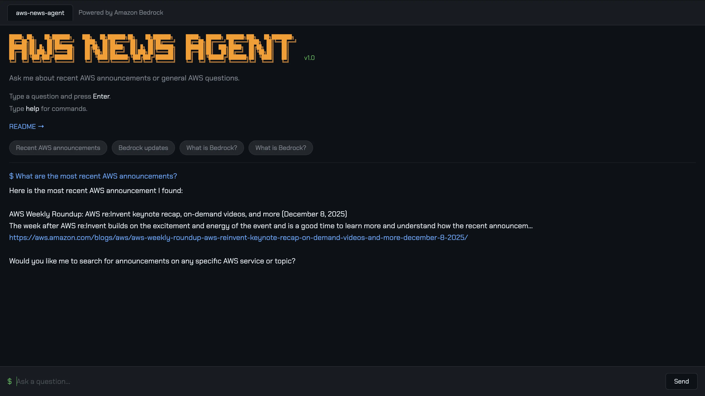

## Overview
An Amazon Bedrock agent that searches the AWS News Blog RSS feed to answer questions about recent AWS announcements. Ask questions like "What's new with Bedrock?" or "Any recent Lambda updates?" and the agent retrieves live RSS data, identifies relevant posts, and returns summaries with direct links.

**Key features:**
- Live RSS feed search (no database or knowledge base)
- Multi-turn conversation support
- Terminal-style web interface
- Minimal infrastructure

## Architecture

```
Amplify UI → API Gateway → Invoker Lambda → Bedrock Agent → Action Group → RSS Search Lambda
```

The agent decides whether to answer from its training data or invoke the RSS search tool for current announcements.

## Repository Contents

| File | Description |
|------|-------------|
| `index.html` | Terminal UI frontend |
| `invoker_agent.py` | Lambda function that calls the Bedrock agent |
| `search_aws_news.py` | Lambda function that searches the RSS feed |
| `openapi-schema.yaml` | Action group API definition |
| `system-prompt.txt` | Bedrock agent system prompt |
| `test-agent.sh` | CloudShell script to test API endpoint |
| `bedrock-agent-lambda-invoke-policy.json` | IAM policy for agent Lambda invocation |
| `bedrock-invoke-agent-policy.json` | IAM policy for invoking Bedrock agent |

## Documentation

**Read the full docs:** [docs.digitalden.cloud](https://docs.digitalden.cloud/posts/building-a-bedrock-agent-with-aws-news-search)

## Quick Start

1. Follow the [full documentation](https://docs.digitalden.cloud/posts/building-a-bedrock-agent-with-aws-news-search) to deploy the backend
2. Update `API_ENDPOINT` in `index.html` with your API Gateway URL
3. Deploy `index.html` to AWS Amplify
4. Open the terminal and ask "What's new with Bedrock?"

## License

MIT